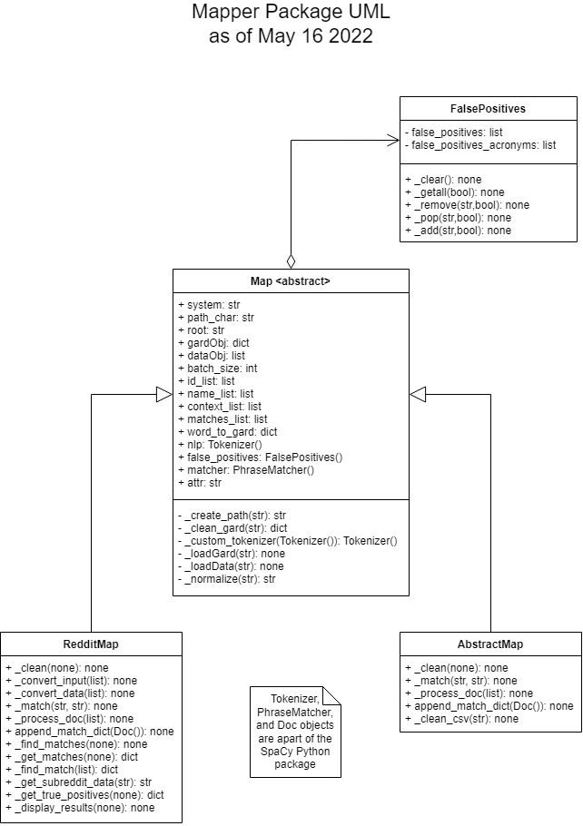

# Introduction
NormMap V2 is a python based package which maps a specific data source to a rare disease(s). NormMap V2 is the second version of NormMap which features several improvements from the previous algorithm such as parallel processing and different mapping methods such as using the `SpaCy` PhraseMatcher package 



## Required packages
```
pandas==1.4.2
spacy==3.2.1
```

## Accepted input file types
### Abstract Mapper
#### Rare Disease Data
- json
#### Data to map to rare diseases
- txt
- csv
- xlsx
### Subreddit Mapper
#### Rare Disease Data
- json
#### Data to map to rare diseases 
- json

## Matching with NormMap V2
The only function you will need to match is `_match()` once the specific object is instantiated

For example if you wanted to match with Abstract data:
```
map = AbstractMap()
map._match('filtered_abs.txt','neo4j_rare_disease_list.json')
```
Parameter 1 is the file you want to be mapped and parameter 2 is the rare disease data

## Adding different types of data to be mapped
Part of NormMap V2's improvements is the ability to easily expand different types of data beyond Abstract and Subreddit data. To do this you will need to make another class and have it inherit the `Map` class and override the `_match()` method and use the inherited methods from the `Map` for normalization and matching

# Source Code
## `bin` folder
Contains the NormMap V2 python code as well as all the data
## `data` folder
Store both the input and output data
## `input` folder
Stores the data used to map. The rare diseases list necessary for mapping comes from Neo4j data lake at https://disease.ncats.io
## `output` folder
Stores all output from NormMap V2
## `doc` folder
Contains all of the documentation for NormMap V2. More detailed documentation is stored [here](doc/Mapper_Description.docx)
## `__init__.py`
Placeholder and example file that can be used to run the mapping process
## `Map.py`
Parent class of all NormMap V2 classes. Contains all of the shared methods between all the children
## `AbstractMap.py`
Specific mapping class used for Abstract (scientific article) data
## `RedditMap.py`
Specific mapping class used for subreddit data
## `FalsePositives.py`
Object used to store all of the false positives that will be ignored when mapping
